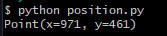
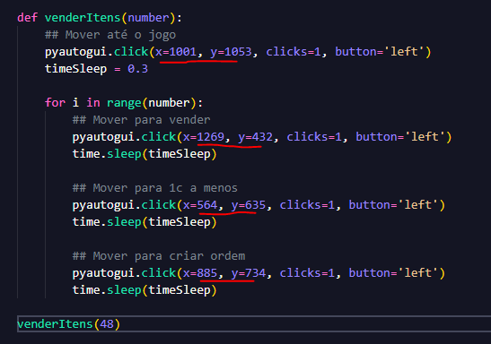

# README

Necessário instalar a lib pyautogui.

https://pyautogui.readthedocs.io/en/latest/install.html

```
pip install pyautogui
pip3 install pyautogui

```

A lib pyautogui vai simular o seu mouse, por conta disso é necessário atualizar o local onde vai ocorrer o click no arquivo **scripts.py** a depender da resolução do seu monitor.

o arquivo **position.py** vai auxiliar a encontrar a posição correta.



### Setup inicial

No arquivo **scripts.py** vamos modificar 4 posições.



Após as modificações basta executar o script e profitar, veja o video de exemplo.

Importante que o albion deve estar com o mercado aberto na parte de venda antes de iniciar o script conforme imagem abaixo.


